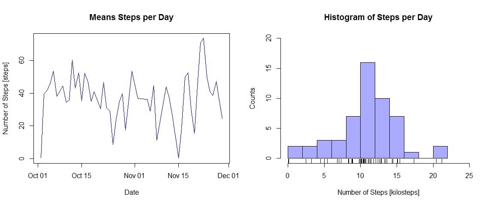
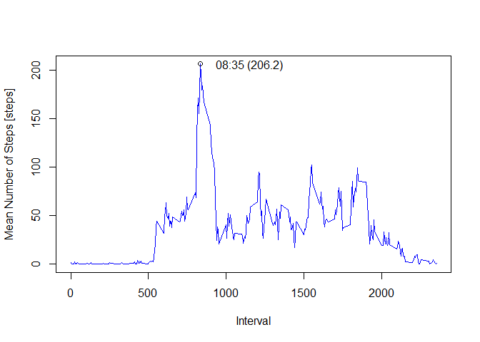
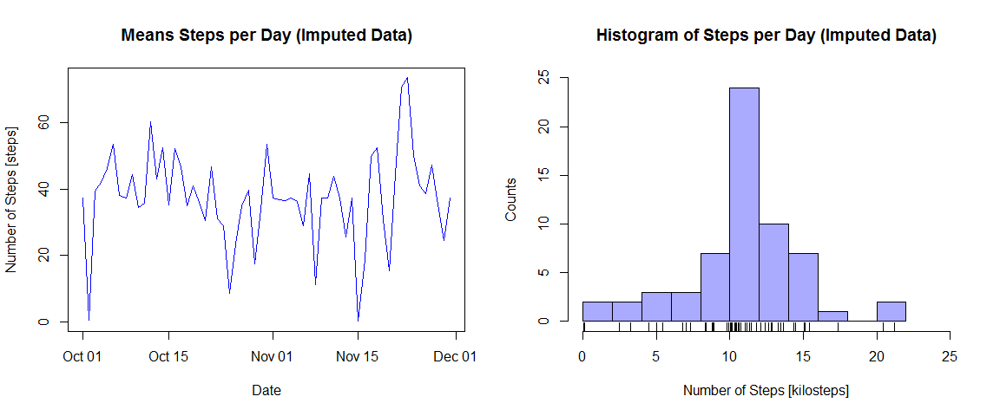
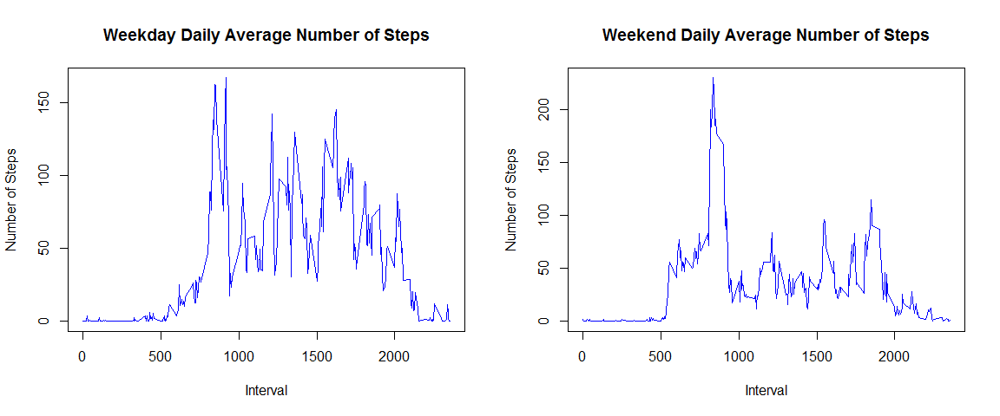

# Reproducible Research: Peer Assessment 1


## Loading and preprocessing the data
The source data for this analysis is located in a comma-separated value (CSV) file with three variables:

* **steps** The number of steps taken in a given 5-minute interval
* **date** The date the step count was recorded
* **interval** The starting time of the interval, with leading zeros dropped

Data is loaded by reading the CSV file and casting the `steps` and `interval` variables as (32 bit) integers, and the `date` variable as the `character` data type. The `interval` variable is converted to a `character` array to include leading zeros, is concatenated with the `date` variable, and is then cast as a `POSIXct` data type[^1]:

[^1]: Also note that the string `date` variable is factorized.


```r
raw_data <- read.csv(".//activity.csv",
              colClasses=c("integer", "character", "integer"),
              stringsAsFactors=TRUE,
              header=TRUE)
# Format interval as string with leading zeros
aux_intervals <- sprintf(raw_data[,"interval"], fmt="%04i")
# Concatenate date and interval/time character arrays, cast as POSIXlt type
aux_datetime <- as.POSIXct(
              paste(raw_data[,"date"], aux_intervals, sep=" "),
              format="%Y-%m-%d %H%M")
# Add datetime to raw_data
raw_data[,"datetime"] <- aux_datetime
# Example POSIXct data: 238th 5-minute interval on second day, 2013-10-02 @ 19:50 or 7:50 PM
strftime(raw_data[289 + 238, "datetime"], format="%b %d %Y, %H:%M:%S")
```

```
## [1] "Oct 02 2012, 19:50:00"
```


## What is mean total number of steps taken per day?
The mean number of steps per day is calculated ignoring `NA` values (the daily median is uniformly zero):


```r
# Calculate mean by day, ignoring `NA` values
daily_mean <- aggregate(raw_data[,"steps"]~raw_data[,"date"], FUN=mean, na.action=na.omit)
# Calculate median by day, ignoring `NA` values
daily_median <- aggregate(raw_data[,"steps"]~raw_data[,"date"], FUN=median, na.action=na.omit)
# Calculate histogram of steps per day (via daily sum)
daily_sum <- aggregate(raw_data[,"steps"]~raw_data[,"date"], FUN=sum, na.action=na.omit)
# Calculate global mean and median
global_mean <- mean(daily_sum[,2])
global_median <- median(daily_sum[,2])
```

```r
# Plot results
par(mfrow=c(1,2))
plot(as.Date(daily_mean[,1]), daily_mean[,2],
     type="l",
     col="blue",
     main="Means Steps per Day",
     xlab="Date", ylab="Number of Steps [steps]")
hist(daily_sum[,2]/1000,
     col="#AAAAFF",
     xlab="Number of Steps [kilosteps]", ylab="Counts",
     breaks=10,
     xlim=c(0, 25), ylim=c(0, 20),
     main="Histogram of Steps per Day")
rug(daily_sum[,2]/1000)
```

 

Calculating the global mean and median steps per day[^2]:


```r
# Assemble table
summary_table <- data.frame(
  Op=c("Mean [kilosteps]", "Median [kilosteps]"),
  NAs_Ig=c(global_mean, global_median)/1000
  )
# Render table
knitr::kable(summary_table,
             col.names=c("Operation", "NAs Ignored"))
```


Operation             NAs Ignored
-------------------  ------------
Mean [kilosteps]         10.76619
Median [kilosteps]       10.76500

[^2]: The mean of 10.766 kilosteps per day averages to 11.215 steps per waking minute or  0.319 miles per hour, assuming a 16-hour waking day and 2.5 foot (76 cm) step.


## What is the average daily activity pattern?
The average daily activity pattern is computed by calculating the mean value across each time interval over all days. This is acheived by repeating the process used to calculate the daily mean and median above. In these calculations, `NA` values are ignored.


```r
# Calculate mean by time interval, ignoring `NA` values
interval_mean <- aggregate(raw_data[,"steps"]~raw_data[,"interval"], FUN=mean, na.action=na.omit)
# Find time interval with maximum average number of steps
max_mean_steps <- max(interval_mean[,2])
max_mean_interval <- interval_mean[which(interval_mean[,2]==max_mean_steps), 1]
max_mean_time <- as.POSIXct(sprintf(max_mean_interval, fmt="%04i"), format="%H%M")
# Plot mean as a function of interval
plot(interval_mean[,1], interval_mean[,2],
     type="l",
     col="blue",
     xlab="Interval", ylab="Mean Number of Steps [steps]")
points(max_mean_interval, max_mean_steps, pch=1)
label_str <- paste0(strftime(max_mean_time, format="%H:%M"),
                   " (", sprintf(max_mean_steps, fmt="%3.1f"), ")")
text(max_mean_interval+100, max_mean_steps,
     labels=as.character(label_str),
     adj=c(0,0.5))
```



The maximum average number of steps (206.2) occurs in the 08:35 interval.


## Imputing missing values
Finding incomplete entries and replacing these entries by their interval's mean value:


```r
# Identify incomplete entries and count
entry_is_inc <- is.na(raw_data[,"steps"])
inc_entry_intervals <- raw_data[entry_is_inc, "interval"]
inc_entry_count <- length(entry_is_inc)
# Replace incomplete entries with interval averages in new copy
filled_data <- data.frame(steps=raw_data[,"steps"],
                          date=raw_data[,"date"],
                          interval=raw_data[,"interval"])
filled_data[entry_is_inc, "steps"] <- sapply(inc_entry_intervals,
                                      function(x) return(interval_mean[x==interval_mean[,1], 2]))

# Calculate mean by day
filled_daily_mean <- aggregate(filled_data[,"steps"]~filled_data[,"date"], FUN=mean)
# Calculate median by day
filled_daily_median <- aggregate(filled_data[,"steps"]~filled_data[,"date"], FUN=median)
# Calculate histogram of steps per day (via daily sum)
filled_daily_sum <- aggregate(filled_data[,"steps"]~filled_data[,"date"], FUN=sum)
# Calculate global mean and median
filled_global_mean <- mean(filled_daily_sum[,2])
filled_global_median <- median(filled_daily_sum[,2])
```

```r
# Plot results
par(mfrow=c(1,2))
plot(as.Date(filled_daily_mean[,1]), filled_daily_mean[,2],
     type="l",
     col="blue",
     main="Means Steps per Day (Imputed Data)",
     xlab="Date", ylab="Number of Steps [steps]")
hist(filled_daily_sum[,2]/1000,
     col="#AAAAFF",
     xlab="Number of Steps [kilosteps]", ylab="Counts",
     breaks=10,
     xlim=c(0, 25), ylim=c(0, 25),
     main="Histogram of Steps per Day (Imputed Data)")
rug(daily_sum[,2]/1000)
```

 

Comparing the results of the global mean and median calculations when ignoring `NA` values to the that for the imputed data:


```r
# Assemble table
summary_table <- data.frame(
  Op=c("Mean [kilosteps]", "Median [kilosteps]"),
  NAs_Ig=c(global_mean, global_median)/1000,
  Imp=c(filled_global_mean, filled_global_median)/1000,
  Diff=c(abs(global_mean-filled_global_mean), abs(global_median-filled_global_median))/1000
  )
# Render table
knitr::kable(summary_table,
             col.names=c("Operation", "NAs Ignored", "Imputed Data", "Difference"))
```


Operation             NAs Ignored   Imputed Data   Difference
-------------------  ------------  -------------  -----------
Mean [kilosteps]         10.76619       10.76619    0.0000000
Median [kilosteps]       10.76500       10.76619    0.0011887

When compared to the prior (`NA`s-ignored) results, as expected the mean does not change while the median is shifted upwards by roughly one step.


## Are there differences in activity patterns between weekdays and weekends?
To explore any difference in activity levels during the weekdays versus weekends, add a factor variable and calculate the average steps per interval:

```r
# Add weekend indicator
filled_data[,"week_day"] <- as.numeric(strftime(aux_datetime, format="%u"))
# Calculate means by weekday/weekend
#   Get subsets of data 
weekday_subset <- subset(filled_data, week_day > 5, select=c("interval", "steps"))
weekend_subset <- subset(filled_data, week_day < 6, select=c("interval", "steps"))
#   Calculate means
weekday_daily_mean <- aggregate(weekday_subset[,"steps"]~weekday_subset[,"interval"], FUN=mean)
weekend_daily_mean <- aggregate(weekend_subset[,"steps"]~weekend_subset[,"interval"], FUN=mean)
```

```r
# Plot
#   I've intentially chosen to create a panel plot laterally instead of vertically as shown in the
#   assignment example- I feel this still respects the request made in the assignment.
par(mfrow=c(1,2))
plot(weekday_daily_mean[,1], weekday_daily_mean[,2],
     xlab="Interval", ylab="Number of Steps",
     type="l",
     col="blue",
     main="Weekday Daily Average Number of Steps")

plot(weekend_daily_mean[,1], weekend_daily_mean[,2],
     xlab="Interval", ylab="Number of Steps",
     type="l",
     col="blue",
     main="Weekend Daily Average Number of Steps")
```

 
